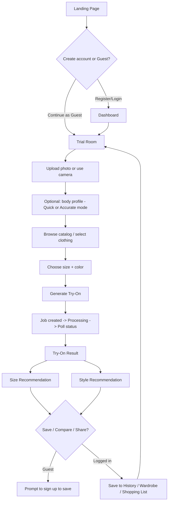
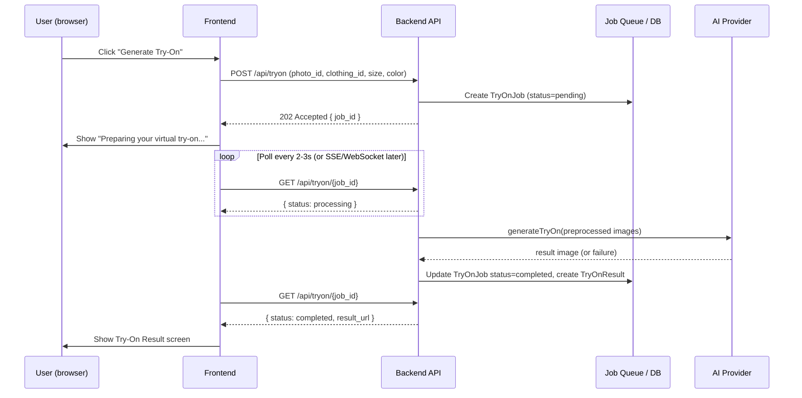

# User Flows

## 1. Main flow (Section 4 of master spec)



## 2. Guest vs authenticated boundary (Section 24)

Guests can do everything up through seeing a try-on result and a size
recommendation **once, ephemerally**. The moment they try to:
- Save an outfit
- View trial history
- Edit a persistent profile

...they hit a login/register prompt. This boundary is enforced server-side
(the `/api/tryon` endpoint accepts an anonymous session token for guests,
but `/api/outfits`, `/api/tryon/history`, and `/api/wardrobe` require a
real authenticated user), not just hidden in the UI — a beginner mistake
would be to only hide the "Save" button in React and forget the backend
check.

## 3. Async try-on flow (Section 32)



If the AI call fails, `TryOnJob.status = failed` with a
`failure_reason` the frontend maps to a plain-language message (Section
36) — never a raw provider error string.

## 4. Body profile flow (Section 5)

- **Quick Mode** — photo + height + weight + usual size only. This is the
  default; nothing else is asked before the user can try something on.
- **Accurate Mode** — an optional, explicitly-opt-in expansion of the same
  form (chest, waist, hip, shoulder, inseam, arm/leg length, preferred
  fit). Stored in the same `BodyMeasurement` row — Accurate Mode doesn't
  create a separate entity, it just fills in more nullable columns.

## 5. Size recommendation flow

```
User measurements (or "usual size" fallback)
        +
Selected product's SizeChart
        +
Fit preference (slim/regular/relaxed/oversized)
        ↓
   Size Recommendation Service (pure function, no AI call needed)
        ↓
{ recommended_size, alternative_size, estimated_fit,
  explanation, confidence }
```

This is a deterministic comparison against the size chart table — not an
AI/ML call. Keeping it separate from the AI try-on service means size
recommendations still work even if the AI provider is down.

## 6. Style/outfit flow

```
Selected clothing item(s) + StylePreference (colors, style, occasion)
        ↓
   Style Recommendation Service (rule-based for MVP)
        ↓
Suggested complementary items from catalog/wardrobe
        ↓
Optional: Outfit Builder → save as SavedOutfit → Outfit Comparison
```

MVP style recommendations are **rule-based** (color-coordination rules +
occasion tagging), not a trained ML model — this is called out explicitly
so we don't accidentally over-promise "AI-powered styling" in the MVP when
it's really a curated rules engine. A real recommendation model is a
Phase 15+ upgrade behind the same service interface.
