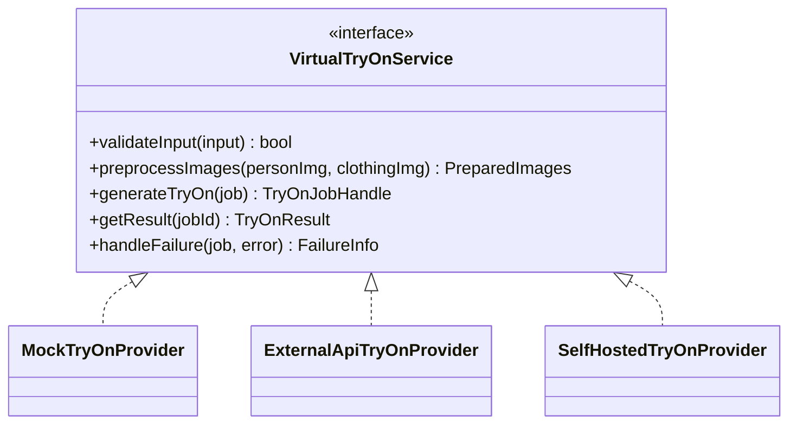

# System, Frontend, Backend & AI Architecture

## 1. System overview

```mermaid
flowchart LR
    subgraph Client
        FE[React + TypeScript SPA]
    end
    subgraph Server
        API[FastAPI Backend]
        DB[(PostgreSQL)]
        STORE[(Image Storage\nlocal disk in dev /\nS3-compatible in prod)]
    end
    subgraph External
        AI[AI Try-On Provider\n(swappable)]
    end

    FE <-->|REST JSON, HTTPS| API
    API <--> DB
    API <--> STORE
    API -->|server-side only, API key never in browser| AI
```

**Why this shape:** the browser never talks to the AI provider or to
storage directly. Every image upload and every AI call goes through the
backend, so API keys stay server-side (Section 26) and we can enforce
"is this user allowed to see this image" (Section 25) in one place.

## 2. Frontend architecture (Section 28)

- **Vite + React + TypeScript** — fast dev server, type safety.
- **Tailwind CSS** — utility styling, keeps the premium-but-simple look
  achievable without a custom design system from day one.
- **React Router** — page routing (Section 34 lists ~20 pages).
- **TanStack Query** — server-state (catalog, try-on job polling, history)
  so we don't hand-roll loading/error/cache logic per page.
- **React Hook Form + Zod** — form state + validation sharing the same
  schema shape the backend's Pydantic models use conceptually.
- **Axios** — thin API client wrapper, one file per resource
  (`api/tryon.ts`, `api/clothes.ts`, ...), never `fetch` scattered through
  components.

Folder shape (created in Phase 2, shown here for context):

```
frontend/
  src/
    api/            # one file per backend resource, all HTTP calls live here
    components/      # small reusable pieces (Button, ImageUpload, SizeBadge)
    pages/            # one file per route from Section 34
    hooks/            # useTryOnJob(), useAuth(), etc.
    types/            # shared TS types mirroring backend schemas
    lib/              # zod schemas, query client, constants
    App.tsx           # routes only — no business logic
```

Rule we'll hold to: **no giant components.** A page file composes smaller
components; it doesn't contain a 400-line JSX blob.

## 3. Backend architecture (Section 29)

- **FastAPI** — async, typed, auto-generates OpenAPI docs (useful since
  Section 47 wants API documentation in the README).
- **PostgreSQL + SQLAlchemy + Alembic** — relational data with real
  foreign keys (users own photos own try-on jobs own results — this is
  inherently relational, not document-shaped) and versioned migrations.
- **Pydantic** — request/response validation, shared serialization layer.
- **JWT auth** — stateless sessions, works cleanly with a future mobile
  client or B2B API consumer.

```
backend/
  app/
    api/            # route handlers ONLY — parse request, call a service, return response
    core/           # config, security (hashing, JWT), settings from env vars
    models/         # SQLAlchemy ORM models (Section 30 tables)
    schemas/        # Pydantic request/response models
    services/        # business logic: SizeRecommendationService, StyleRecommendationService, etc.
    repositories/     # DB query layer (keeps SQLAlchemy queries out of services)
    ai/               # VirtualTryOnService + provider adapters (below)
    utils/            # image validation, file naming, etc.
  tests/
```

**Why `services/` + `repositories/` are separate layers:** a route handler
should read almost like pseudocode — "validate input, call the service,
return the result." Business rules (how a size is chosen, how a job's
status transitions) live in `services/`. Raw SQL/ORM queries live in
`repositories/`. This means we can unit-test `SizeRecommendationService`
with fake data and never touch a real database.

## 4. AI provider architecture (Sections 12–13) — the most important part to get right early



- Route handlers and the job-queue logic depend only on the
  `VirtualTryOnService` interface — never on a concrete provider class.
- Which implementation gets used is chosen once, in config, from an
  `AI_PROVIDER` env var (e.g. `mock`, `external_api`, `self_hosted`).
- **`MockTryOnProvider` is real, checked-in code** (Section 50: "never
  pretend a mock AI response is a real AI result") — it returns a clearly
  labeled placeholder result during development when no real API key is
  configured, so the whole request/job/poll/result flow can be built and
  tested before we have API access to a real try-on provider. The
  response includes `"provider": "mock"` so the frontend/logs can never
  confuse it with a real generation.
- Async by default: `generateTryOn()` returns a job handle immediately;
  a background worker (or the provider's own webhook/poll) fills in the
  result later. This matches Section 32 even for providers that are
  technically synchronous — we don't want a code path that blocks an HTTP
  request for 30+ seconds.

`VideoTryOnService` (Section 18) is written as an empty interface in the
same `ai/` module now, with no implementation — a placeholder so Phase
7's job-queue design doesn't accidentally paint us into a photo-only
corner, without building video support itself.

## 5. Image storage & security architecture (Sections 25–27)

- Dev: images saved to a local `storage/` folder on disk, served through
  an authenticated backend route (never a public static folder) —
  so "no public image access by default" is true even in dev.
- Prod: same interface, backed by S3-compatible object storage with
  private buckets + short-lived signed URLs.
- Every image fetch goes through `GET /api/.../{id}/photo`-style routes
  that check `current_user.id == resource.owner_id` before streaming the
  file — ownership check lives in one shared dependency, not copy-pasted
  per route.
- Upload validation happens in `utils/` before anything touches disk:
  MIME sniff (not just extension), size limit, dimension check.

## 6. Folder structure (Section 44, decided)

Since this repo (`Trial-Room/`) is already the project root, we're using
it directly as the monorepo root instead of nesting another
`virtualfit-ai/` folder inside it:

```
Trial-Room/                  <- repo root (this becomes "virtualfit-ai" conceptually)
  frontend/
  backend/
  docs/                       <- you are here
  tests/                      <- cross-cutting/e2e tests; unit tests live next to their code
  README.md
  .env.example
  .gitignore
  docker-compose.yml
```

If you'd rather rename the working folder to `virtualfit-ai` later, that's
a simple `mv` — nothing in the code will depend on the folder's name.
