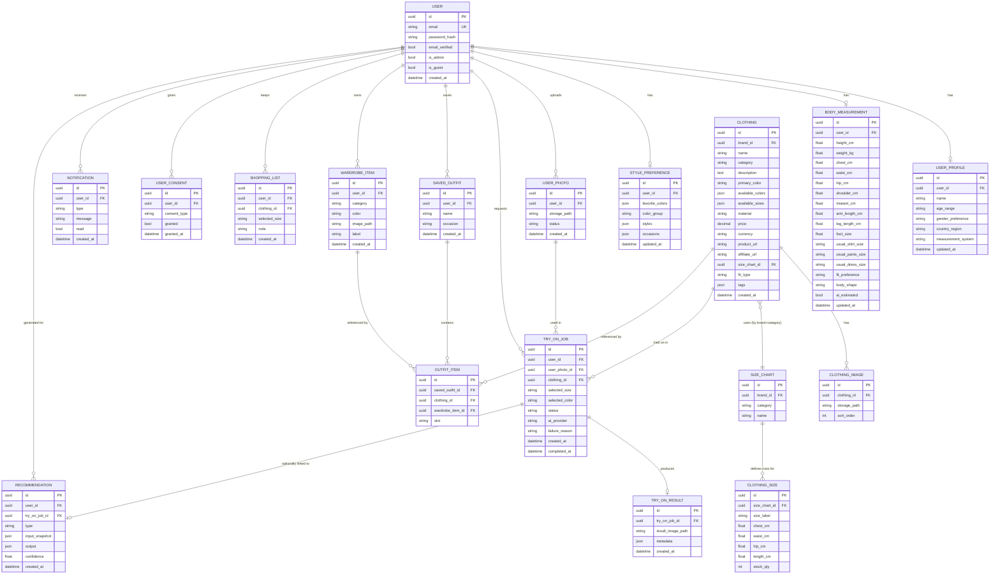

# Database Design (Section 30)

## 1. Entity-relationship diagram

## 2. Key design decisions

- **`UserProfile`, `BodyMeasurement`, `StylePreference` are 1-to-1 with
  `User`**, not repeating-history tables. If we ever want measurement
  history, that's an additive migration (add a `version`/`is_current`
  column) rather than a rethink — no need to over-engineer this now.
- **`SizeChart` is decoupled from `Clothing`** (many products share one
  chart per brand+category) instead of copy-pasting chest/waist/hip
  numbers onto every product row. `ClothingSize` rows are the actual
  per-size measurements belonging to a chart. This directly implements
  Section 10's "do not depend only on S/M/L/XL" — `ClothingSize.size_label`
  can be any string, and the numeric columns are what the size engine
  actually compares against.
- **`TryOnJob` and `TryOnResult` are separate** so the async flow
  (Section 32) has somewhere to live: a job can exist in `pending` /
  `processing` / `failed` state with no result row yet. One job → at most
  one result; regenerating creates a new job, preserving history instead
  of overwriting.
- **`Recommendation` is a generic table** for both size and style
  recommendations (`type` discriminates), storing the exact input
  snapshot and output — this makes "explain why you recommended this"
  (Section 11/17) auditable later instead of recomputed guesswork.
- **`OutfitItem.clothing_id` and `wardrobe_item_id` are both nullable
  FKs**, exactly one set — an outfit slot can point at a catalog product
  or a user's own wardrobe photo. Enforced at the application layer
  (service-level check), not a DB constraint, to keep the schema simple
  for a beginner to read.
- **No password column stores plaintext** — `password_hash` only, hashed
  with a strong algorithm (bcrypt/argon2) chosen in Phase 4.
- **`is_guest` on `User`** lets a guest session reuse the same table
  (with no email/password) rather than a parallel guest-data model,
  which would double the number of code paths for very little benefit.

## 3. What's intentionally NOT modeled yet

- Payments/subscriptions (Section 42) — no `Subscription`/`Plan` tables
  yet; added when Phase 15 business-model work starts.
- Brand/merchant admin accounts — `brand_id` exists on `Clothing` and
  `SizeChart` as a plain UUID FK placeholder; a full `Brand` table with
  its own auth comes with the B2B phase.
